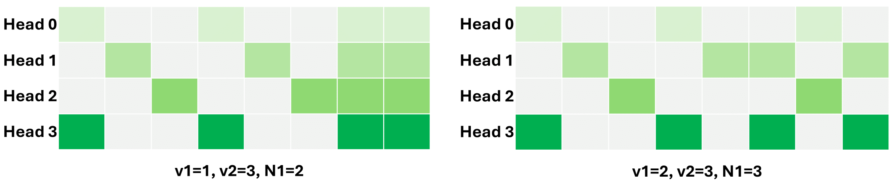
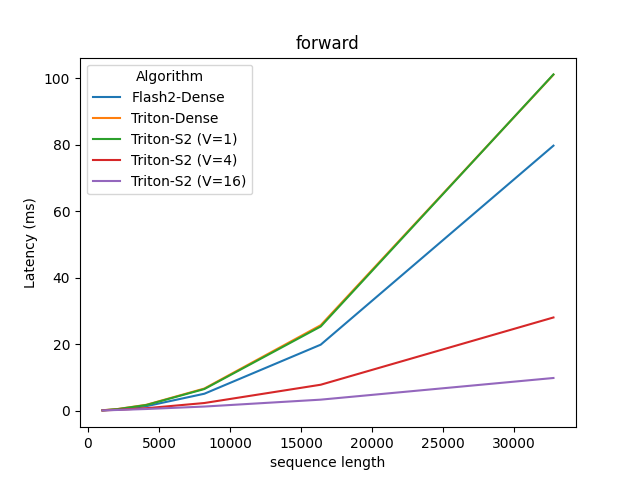
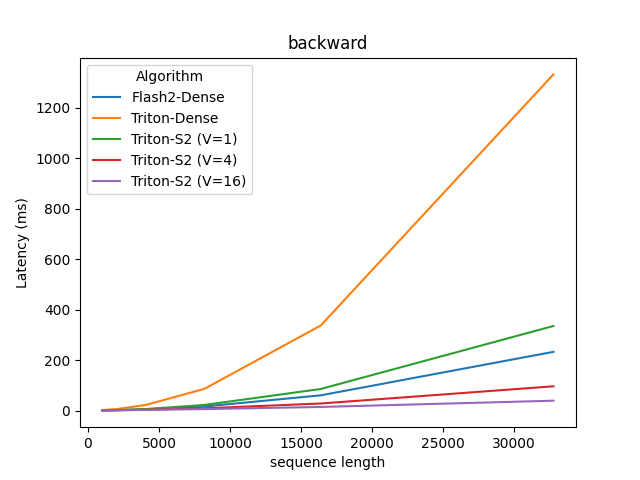

# Introduction

This repo contains customized CUDA kernels written in OpenAI Triton.
As of now, it contains the sparse attention kernel used in [phi-3-small models](https://huggingface.co/microsoft/Phi-3-small-8k-instruct).
The sparse attention is also supported in vLLM for efficient inference.

An illustration of heterogeneous(per head) local-stride block sparse pattern


Paper: WIP.


# Install

```sh
pip install git+https://github.com/linxihui/dkernel
```

# Quick start

```python
import torch
from dkernel import SparseAttention, LocalStrideSparseAttention


# 1.) Using local-stride pattern

block_size = 64 # sparse block size, minimum 16
local_blocks = 32 # num local blocks, always attend to up to 64 * 16=1024 tokens
vert_stride = 8 # attend to 1 block per every 8 blocks after the local window above
max_seq_len = 8192 # model supports up to 8192 seqlen
num_heads = 32
device = "cuda"

q, k, v = [torch.rand(2, 8192, 32, 128,
                device=device).requires_grad_()
                for _ in range(3)]

attn = LocalStrideSparseAttention(
                 num_heads,
                 max_seq_len,
                 block_size,
                 local_blocks,
                 vert_stride,
                 seq_dim=1, # q/k/v layout: (batch, seq, heads, head_dim)
                )
attn.to(device) # optional, attn default to current_device

# For the first time, it needs to warmup, so could be slow.
attn(q, k, v, return_lse=True)

# Now should be fast
ouput, lse = attn(q, k, v, return_lse=True)

## lse can be used to combine results of multiple kv partitions,
## see `dkernel.combine_attn_partitions` 

# 2.) Using user defined arbitrary pattern

num_blocks = max_seq_len // block_size

# True/1 means attn to the blocks, 0 means not attend to.
block_sparse_pattern = torch.rand((num_heads, num_blocks, num_blocks)) > 0.8

# Ensure the diag blocks are always attended.
# Otherwise, tokens at block_0 have nothing to attend to, resulting in nan
for head_sparse_pattern in block_sparse_pattern:
    head_sparse_pattern.diagonal()[:] = True

# Ensure it is causal
block_sparse_pattern *= torch.tril(torch.ones_like(block_sparse_pattern[0]))

# NOTE: You may get warning saying that pattern is not KV cache efficient, due to
# KV cache needed for later tokens are not used in earlier tokens.
# This may result in unexpected larger KV cache.
# So you may need to re-consider the design of the sparse pattern.

attn = SparseAttention(block_size, block_sparse_pattern)
attn.to(device)

# similar, it needs to warmup for the first time
output = attn(q, k, v, sm_scale=0.008)
```

## Important note

- For training, sequences in a batch should have the same length. Therefore, only right padding will be handled correctly,
- For inference,
    1. Prefilling phase (prompting/1st token): no padding, left/right paddings as well as packed variable length input are supported.
    2. Decoding phase: only no padding, left/right paddings are allowed. Variable length inputs
    are disallowed as it not efficient for KV cache update.
    
    For better KV cache as well as continuous batching, we recommend to use vLLM, which supports
    the same local-stride sparse attention (checkout the phi-3-small model in vLLM).


# Interface

Initialize an instance from local-stride or user-defined(per-head) block pattern

```python

class SparseAttention(torch.nn.Module):
    def __init__(self,
            block_size: int,
            sparse_pattern: Tensor,
            *,
            causal: bool=True,
            seq_dim: Optional[int]=None,
            block_m: Optional[int]=None,
            block_n: Optional[int]=None,
            out: Optional[Tensor]=None
            **kwargs):

class LocalStrideSparseAttention(SparseAttention):
    def __init__(self,
            num_heads: int,
            max_seq_len: int,
            block_size: int,
            local_blocks: int,
            vert_stride: int,
            *,
            homo_head: bool=False,
            num_dense_heads: int=0,
            num_kv_heads: Optional[int]=None,
            active_head_range: Optional[Tuple[int, int]]=None,
            head_sliding_offset: int=0,
            block_m: Optional[int]=None,
            block_n: Optional[int]=None,
            **kwargs
            )

    """
    Arguments
    =========
    block_size: sparse_block_size.
    sparse_pattern: 2D or 3D (per head) boolean/uint8 Tensor(squared). 1=used, 0=skipped.
    seq_dim: the dimension indice for the token sequence. Default to dimension 1.

    num_heads: number of q heads.
    max_seq_len: max sequence length the model supports.
    local_blocks: number of local blocks (sliding window).
    vert_stride: for non-local blocks, attention to 1 block per `vert_stride` blocks.
    homo_head: the non-local blocks that a token attend to is the same across heads.
    num_dense_heads: numer of heads that are dense. If specified, dense heads are used
        in last heads.
    num_kv_heads: number of kv heads if different from q. If specified, the sparse pattern
        within the same group(shared the same k/v) will be the same for all q heads in the
        group. If this not intended, i.e., k/v within the group have differnt sparse pattern
        (which will results in less KV saving), please repeat the heads of k/v to be the
        same as q before passing them to the `forward` method.
    active_head_range: the start and end head index for the current head partition in case
        of any head parallelization, such as Megatron Tensor slicing, DeepSpeed sequence
        parallellization (which turn sequence parallel to head parallel at attention).
    head_sliding_offsets: 0 means block-0 is always attended to at head-0.
        `n` means block-0 is always attended to at head-n.
    block_m, block_n:  the kernel block size for m blocks (q blocks) and n blocks (k/v blocks).
        Default to `block_size` and must be power of 2 with minimum of 16.
        Reduce them if you experience hardware resource constraint (shared memory).
        In that case, try first reduce `block_n`. If it is not enough, `block_m`.
        Latency-wise, reducing `block_n` likely has no impact, will reducing `block_m`
        may have a bigger impact.

    Methods
    =======
    forward:
        Arguments:
        =========
        q, k, v:
            Case 1: for training (requires backward):
                shape=(batch, seq, heads, head_dim) if self.seq_dim=1 or None (default)
                or shape=(batch, heads, seq, head_dim) if self.seq_dim=2.
                Cannot have left paddings
            Case 2: for inference (does not require backward)
                Can be either 4D like in Case 1, with `left_paddings` or right paddings `seqlens`,
                    or 3D with packed sequence in FlashAttn (total_num_tokens, heads, head_dim), where
                    total_num_tokens = sum(seqlens)
        sm_scale: softmax scale, default to `1/sqrt(q.size(-1))`.
        cu_seqlen_k: shape=(batch+1, ) (0, seqlen1, seqlen1 + seqlen2, ...., sum(seqlens))
            Can only be used at inference.
        cu_seqlen_q: shape=(batch+1, ), similar to above, but for q.
            Can only be used at inference.
        left_paddings: (batch, ), number of left paddings for each sample.
            Can only be used at inference.
        seqlens: real seqlen, can be optionally used when has right padding.
            No need to specify if left_paddings is used.
            Can only be used at inference.
        return_lse: return the softmax logsumexp, which is usual for sequence partition

```

# Benchmarking

You can run the benchmark script to compare it against FlashAttention and Triton's dense attention.

```sh
python ./benchmark/benchmark_sparse_attn.py
```

 | 
:------:|:--------:
Forward | Backward


# Todo

- [ ] *1*. allow change block_m, block_n in backward kernel
- [ ] *2*. allow variable seqlen in a sequence for both forward/backward.
- [ ] *3*. step ahead of 2, unified with left padding (rope with left paddings?)
    i.e., using start/end instead cuseqlen like in 1.
- [ ] *4*. implement loading saving version for grouped attn, which also better
    utilizes tensorcore at inference. This could also potentially allow
    even smaller sparse block size, i.e. 16/q_per_kv
- [ ] 5. split sequence k-length: better GPU/SM utilizaiton for single seq with head parallel
    and inference, especially for very long seq in prefilling and decoding.
- [ ] 6. CPU/V100 version using libTorch.
- [ ] 7. merge N blocks using tl.cat, to reduce cuda core ops to reduce softmax.
    This also opens the possiblity to allow block_n < 16.
    Issue: tl.cat supports only `can_reorder = True`, i.e., at reduction dimention.
- [ ] 8. potentially higher latency with some head is dense (need to check)
- [ ] 9. bwd time increases significantly when sparse_block_size is smaller (fwd is less impacted). This is probably the same issue as 8: some threadblock is just too much, need to break them down., i.e, this is essentially the same as 5.
- [ ] 10. Autotune block_m
- [ ] 11. FP8
- [ ] 12. Inference-prefilling: batched chucked prefix filling
- [ ] 13. Inference-decoding: support different kv_cache size for diff batch, right now,
        only support same past_len as used in megatron for decoding